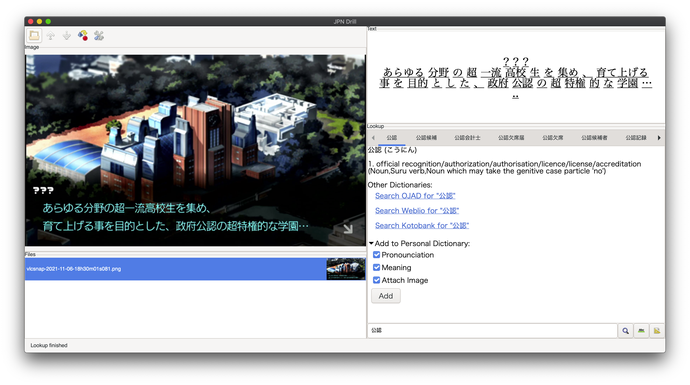

# Japanese Drill

This is a program that I wrote for the sole purpose of helping me drill through words that I don't understand/can't read in games. I've always wanted something like this, but the closest thing I've found are Google Keep notes OCR (which is awful for actually keeping things organized), and OneNote OCR (which is just horrible all around, especially for recognition), so I just took things into my own hands and wrote this. I did manage to mostly finish this way ahead of the Pokemon Brilliant Diamond and Shining Pearl releases, so mission accomplished.

This is one of the projects that I won't be actively maintaining, considering that I've only spent like 20 hours on this and this isn't related to my primary interests. I might however push updates over time on things that I don't particularly like or has diverged from my japanese learning workflow.

## The Point
The point of this is to understand an extremely large amount of text input that might be slightly beyond your level of comprehension. I wouldn't recommend trying this out until reaching at least JLPT N4, so that you don't get completely burned out (it is *possible* to do this at N5, which was what I did back then using the harder way of just looking up every single word in a paper dictionary, but it is difficult).

The workflow is roughly:
1. Play through a game in Japanese, and make a **recording** of your gameplay. The focus is to understand roughly what is happening and what the dialogue/text is saying. For desktop/laptop computers, OBS is a good choice. For my Switch I use a HDMI capture card.
2. Take screenshots of words that you don't fully understand within your recording. This can be easily accomplished with VLC and the Take Screenshot feature (hotkey Shift+S in Windows).
3. Look up the words you don't understand or can't pronounce, and reread the sentence in the corresponding game context.

Step 3 is where Japanese Drill comes in. The hard part of learning Japanese and looking up specific words is that it can be quite tedious and it is tempting to just skip words you don't understand. For me, the hardest parts of learning vocabulary often fall into one of these categories:
- Words/Kanji that I intuitively understand but cannot pronounce (this happens a lot since I also happen to be a native Chinese speaker).
- Words that I am not sure if I'm pronouncing correctly, due to special cases of pronounciation in Japanese (rendaku, unusual readings, etc.).
- Words that have multiple subtle meanings that I do not understand in context.
- Words that I just don't know, onomatopoeia, or weird カタカナ語 that doesn't make sense to me.

The goal of this project is to make looking things up easier and to quickly correct any pronounciation mistakes I have. I found that after looking up the exact same word twice and seeing it in context multiple times, it starts to stick, and that's the point. I found this to be the fastest way of improving my reading comprehension, vocabulary, and reading speed, since my actual memory is very poor and I found very little success in memorizing word lists.

## Usage
Follow the setup steps below first, otherwise it will not work.

See a [basic video rundown](https://youtu.be/Weic1anmPV8) of how it works.

### Drilling Words

- To get started, select a directory containing image screenshots of your recording with the top left `Open` button. They will show up in a list with previews.
- Select the image to inspect. If setup is done correctly, it will automatically OCR words in the selected image and show the text in the `Text` frame.
- At this point, you can either:
  + Edit the text in the frame.
  + Highlight the text you want to search, and press Control+f or Command+f depending on the system. This will add the selected text into the search box below `Lookup` and perform a search on `jisho.com`.
  + Click on the `Action (conversion icon)` on the top left to switch between segmentation and edit modes. Segmentation performs a syntatic breakdown of the sentence. When in segmentation mode, clicking on an underlined text will perform a search on that text, and highlighting a piece of text will perform a search on the highlighted text. The hotkey for this is Control+e or Command+e.
- You can also quickly move down and up an image with the hotkeys Command+j/Control+j and Command+k/Control+k.
- In the search bar below, there is a convenience button that converts katakana to hiragana for the search entry. This is useful because often games use katakana in ways that act more like a different "font" rather than referring to a specific katakana word. Many dictionaries appear to perform poorly when the input is only katakana.

### Building a Personal Dictionary/Deck

Note that the word dictionary here is used with the idea of a deck of "flashcards" rather than an actual comprehensive dictionary.

I find it often useful to work with multiple dictionaries per session of study. You can select the deck you want to work with by going to `Settings (gear icon)` -> `Dictionary` and pick the file you want. Note that dictionaries are just zip files ending in `.dict` with a specific format (json files with image references). Dictionaries are saved upon program close due to the use of zip format to cut down runtime.

- To add a word entry to your dictionary, given a Jisho entry, scroll down to the `Add to Personal Dictionary` section, select the items you need to memorize (Pronounciation/Meaning), and click `Add`. See that a confirmation will show if it is added.
- The bottom left corner of the window has a `Dictionary` button that will list out all the entries you have added. Select an entry to see what needs to be recalled. You can use the hotkeys "j" and "k" to quickly move down and up entries, and the "Backspace" or "Delete" keys to delete an entry you added.

## Setup

Setup is going to be quite difficult, since I haven't really had to time to make publishable/distributable executables for this (this is very tricky to do specifically because of how gtk linking works. I had very little success in getting it to work on MacOS, given that MacOS packaging is already complicated enough). This also requires you to have a Google Cloud Platform account (follow the steps after installation).

### OSX/Linux/*nix
I only use OSX for my builds, although I would be very surprised if this doesn't work for GNU/Linux distros.
- Grab and install a recent build of opam and the ocaml compiler. You can follow the instructions [here for OPAM](https://opam.ocaml.org/doc/Install.html) and [here for the OCaml Compiler](https://ocaml.org/docs/install.html).
- You will need `dune` to compile this. `opam install dune`, and after it succeeds, you will need to install any dependencies for this project. The most outstanding dependencies are `lablgtk3` (which requires the installation of gtk3) and `ocurl` (which requires curl headers). If you don't know what or how to install these, run `make` in the project root directory and it will give you explicit guidance on what and how to install them.
- After all dependencies are installed, running `make` will build and start the program. Follow the setup instructions below on setting up your Google Cloud Platform API keys.

### Windows
You are probably out of luck as of writing. While the instructions above do work for Windows Subsystem for Linux, as far as I tested it (and I could be doing it wrong), support for Japanese Input is essentially nonexistent, so if you need to make some text modifications you'll be out of luck. I believe `dune` is attempting to add proper Windows compatibility in upcoming builds.

### Setting up your Google Cloud Platform Account and API Keys
You will need a Google Cloud Platform Account to use this. This is because OCR critically requires Google Vision APIs and segmentation requires Google Natural Language Syntax APIs. I found that the accuracy of tesserect to be too poor to be useful for Japanese, in comparison.
Note that Google Cloud has a [free tier](https://cloud.google.com/free/docs/gcp-free-tier#free-tier-usage-limits) for all users. Hence all API requests will remain free as long as you [do not exceed 1000 image requests per month](https://cloud.google.com/vision/pricing) and [5k text segmentations per month](https://cloud.google.com/vision/pricing), which is fairly generous unless you are actually doing this all day every day.

- Apply for a [Google Cloud Account](https://cloud.google.com/).
- [Create a new Google Cloud Project](https://cloud.google.com/resource-manager/docs/creating-managing-projects) and name it anything.
- Go to your [Google Cloud Console](https://console.cloud.google.com/) and click `Sidebar` -> `API & Services` -> `Dashboard`. Then find and click on `ENABLE APIS AND SERVICES`.
- Search for `Cloud Vision API` and enable it. Do the same for `Cloud Natural Language API`.
- You will then need to create an API key. Click on `Sidebar` -> `API & Services` -> `Credentials`. Then find and click on `CREATE CREDENTIALS` -> `API Key`. Copy this key. **IT IS IMPORTANT THAT YOU DO NOT SHARE THIS KEY WITH ANYONE ELSE**
- In Japanese Drill, click on `Settings (gear icon on the top left)`, then paste your API key into the `GCloud API Key` field. You should then be all set.

## License

This under the Apache License Version 2.0.
